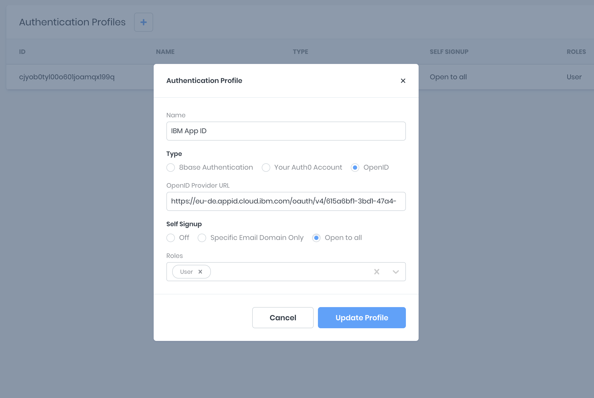

# 8base OpenID Server Setup

**8base** supports connecting to an external authentication provider that supports the OpenID specification for *Professional* and *Enterprise* plans. To use this feature, there is some light setup required in the Managment Console and a custom *resolver* function that should be deployed to your project's workspace.

### Configuring the OpenID Settings

In the 8base Management Console you're able to configure one or more authentication providers under `Settings > Authentication`. Click the "+" button and fill out the provider form, selecting *OpenID* as the type and adding a OpenID Provider URL. Once completed, the record will be saved to your *Authentication Profiles*.

### getToken Resolver

In the `openid-app/server/src` directory we've declared the *getToken* mutation, along with the *TokenResult* response type. 

In the *getToken* function, the relevant environment variables are being accessed - as they are set in the Management Console - to provide the required credentials and configurations. A request is then made to the authentication provider, the authenticating user queried from the database - or created when not found - and token returned.

### Setting Environment Variables

To set environment variables that can be accessed from within custom functions, open up your workspace and navigate to `Settings > Environment Variables`. Here, any key-value pair may be securely stored and accessed from within your functions at `process.env.<ENV_VARIABLE_KEYNAME>`.

### Troubleshooting

If you're unable to get the authentication provider to work and are recieveing a "Not Authorized" error message, you may need to update the associated role and it's API permissions. You can do this by first ensuring that the configured provider has an associated role, like *Guest*. Next, navigate to `Settings > Roles > [ROLE_NAME] > Data` and ensure that the role is enabled for the *Get Token* function call.